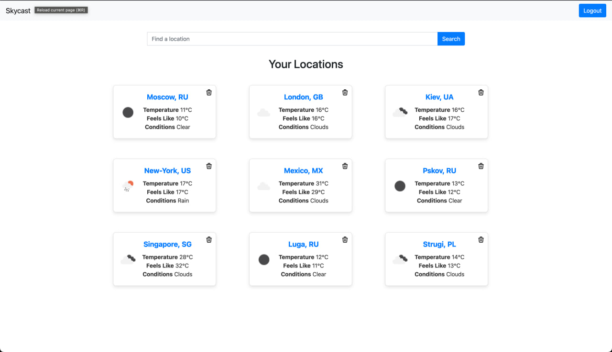

# Skycast

[English Version](#english-version) | [Русская версия](#русская-версия)

## English Version

## Description

Skycast is a web application to check up the current weather. User can signup and start adding any locations.
After this homepage starts to show added locations

## Technologies Used

### Back-end:
- Java 19
- Apache Tomcat Server 10.1.8
- Servlets 6
- Gradle 8.7
- Hibernate ORM 6.4.4
- MariaDB database
- JUnit5
- Mockito
- Thymeleaf 3.1.2

### Front-end:
- HTML
- CSS
- Bootstrap 5

### Deploy
- Docker

## Implementation

### MVCs pattern
- A model layer is a hibernate entity with DAO classes processing basic crud operations.
Additionally, it has DTO classes to transfers required data between layers and classes 
- A view layer is HTML+CSS stack using Bootstrap 5
- A controller layer is number of jakarta servlets. Also it has cookie implementation to
remember user when he is logged in

## Installation and Running

1. Clone the repository: git clone https://github.com/Darfik43/skycast
2. Get your [APIKey](https://openweathermap.org/)
3. Insert your key into /skycast/src/main/resource/config.properties
4. Open Terminal
5. cd [path-to-repository]/skycast
6. docker compose build
7. docker compose up
8. Open browser and go localhost:8080/skycast

## Authors

Author: Darfik43

## Contact

darfik43@gmail.com

## Русская версия
# Skycast

## Описание
Skycast - это веб-приложение для проверки текущей погоды. Пользователь может зарегистрироваться и начать добавлять любые местоположения.
После этого на главной странице они начнут отображаться.

## Используемые технологии

### Back-end:
- Java 19
- Apache Tomcat Server 10.1.8
- Servlets 6
- Gradle 8.7
- Hibernate ORM 6.4.4
- База данных MariaDB
- JUnit5
- Mockito
- Thymeleaf 3.1.2

### Front-end:
- HTML
- CSS
- Bootstrap 5

### Deploy
- Docker

## Реализация

### Паттерн MVC

- Слой моделей представляет собой Hibernate сущности с DAO классами, обрабатывающими основные CRUD операции. Также добавлены классы DTO для передачи необходимых данных между слоями и классами.
- Слой представления - это стек HTML+CSS с использованием Bootstrap 5.
- Слой контроллеров - Jakarta Servlets. Также реализована работа с куки для запоминания пользователя при входе в систему.

## Установка и запуск

1. git clone https://github.com/Darfik43/skycast
2. Зарегистрировать и получить [API ключ](https://openweathermap.org/)
3. Ключ надо добавить в /skycast/src/main/resource/config.properties
4. Откройте терминал
5. cd [путь-к-репозиторию]/skycast
6. docker compose build
7. docker compose up
8. Откройте браузер и перейдите на localhost:8080/skycast

## Автор

Darfik43

## Контакты
darfik43@gmail.com

